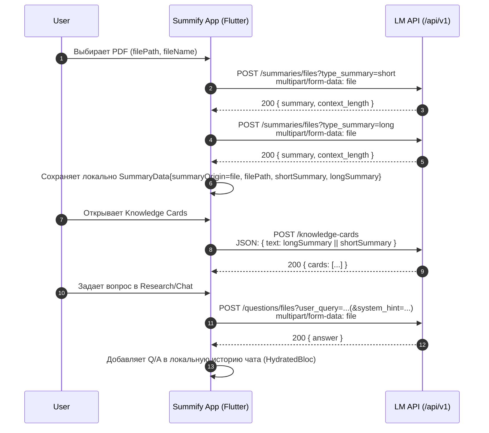

# PDF -> Summary -> Cards/Chat: Sequence и Payload

Документ описывает фактический flow для PDF в текущем клиенте (`SummifyFlutter`) и точные поля, которые отправляются на backend.

## Sequence Diagram

## Endpoints и точные payload-поля

### 1) Генерация summary из PDF

**Endpoint**
- `POST /api/v1/summaries/files`

**Query params**
- `type_summary`: `short` | `long`

**Body (multipart/form-data)**
- `file`: бинарный PDF файл

**Response (200)**
- `summary`: `string`
- `context_length`: `int`

**Комментарий**
- Клиент делает **два отдельных запроса**: сначала `short`, затем `long`.

---

### 2) Генерация Knowledge Cards

**Endpoint**
- `POST /api/v1/knowledge-cards`

**Body (application/json)**
- `text`: `string`
  - Берется как `longSummary.summaryText ?? shortSummary.summaryText ?? ''`

**Response (200)**
- `cards`: `array`
  - Элементы массива маппятся в:
    - `id`
    - `type`
    - `title`
    - `content`
    - `explanation` (optional)

**Комментарий**
- Для карточек уходит **только текст summary**, исходный PDF повторно не отправляется.

---

### 3) Chat/Research по PDF

**Endpoint**
- `POST /api/v1/questions/files`

**Query params**
- `user_query`: `string` (текст вопроса пользователя)
- `system_hint`: `string` (optional; например `diagram`)

**Body (multipart/form-data)**
- `file`: бинарный PDF файл

**Response (200)**
- `answer`: `string`

**Комментарий**
- При **каждом новом вопросе** в режиме `SummaryOrigin.file` клиент повторно отправляет файл.
- История предыдущих сообщений в этом запросе **не отправляется**.

### 3.1 Нагрузка и стоимость такого подхода

Текущая модель для PDF-чата: **каждый вопрос = новая отправка полного файла**.

**Что это значит на практике**
- Если PDF весит `N MB`, то каждый вопрос добавляет примерно `N MB` upload-трафика (плюс накладные расходы multipart/HTTP).
- При `Q` вопросах суммарный upload только на чат примерно `N * Q MB`.
- До чата файл уже был отправлен минимум 2 раза на summary (`short` + `long`), то есть стартовый upload уже около `2N MB`.

**Пример**
- PDF `12 MB`
- 8 вопросов в чате
- Трафик только на чат: `12 * 8 = 96 MB`
- С учетом initial summary: еще `24 MB`
- Итого минимум около `120 MB` upload за один документный сценарий.

**Риски**
- Выше задержка ответа на вопрос (нужно снова загрузить файл перед инференсом).
- Заметный расход мобильного трафика.
- Более высокая чувствительность к плохому соединению.
- Дополнительная нагрузка на backend storage/IO при больших файлах и длинных сессиях.

**Почему так сделано сейчас**
- API для `/questions/files` stateless относительно контекста документа.
- Клиент не передает `document_id`/`session_id` для переиспользования уже загруженного контента.
- Поэтому backend каждый раз получает источник заново через `file`.

## Что хранится локально и что уходит на сервер

**Локально (HydratedBloc)**
- `SummaryData.filePath`
- `SummaryData.summaryOrigin = file`
- `shortSummary`, `longSummary`
- История чата (`ResearchState.questions[summaryKey]`)

**На сервер уходит**
- Для summary: PDF файл + `type_summary`
- Для cards: текст summary (`text`)
- Для chat: PDF файл + `user_query` (+ optional `system_hint`)

## Транспортные детали

- Базовый хост по умолчанию: `https://api.lmnotebookpro.com`
- Есть fallback-хосты при network-failure (на уровне клиента).
- Для всех `/api/v1/...` запросов добавляется заголовок:
  - `X-API-Key: <configured-in-client>`

## Быстрый итог

- Первый этап (summary): PDF отправляется 2 раза (`short`, `long`).
- Карточки: отправляется только summary-текст.
- Chat по PDF: файл отправляется снова на каждый вопрос.
- Диалог на клиенте отображается как чат, но API-вызовы по факту stateless относительно истории.
- Для больших PDF это может быть накладно по трафику и latency.
