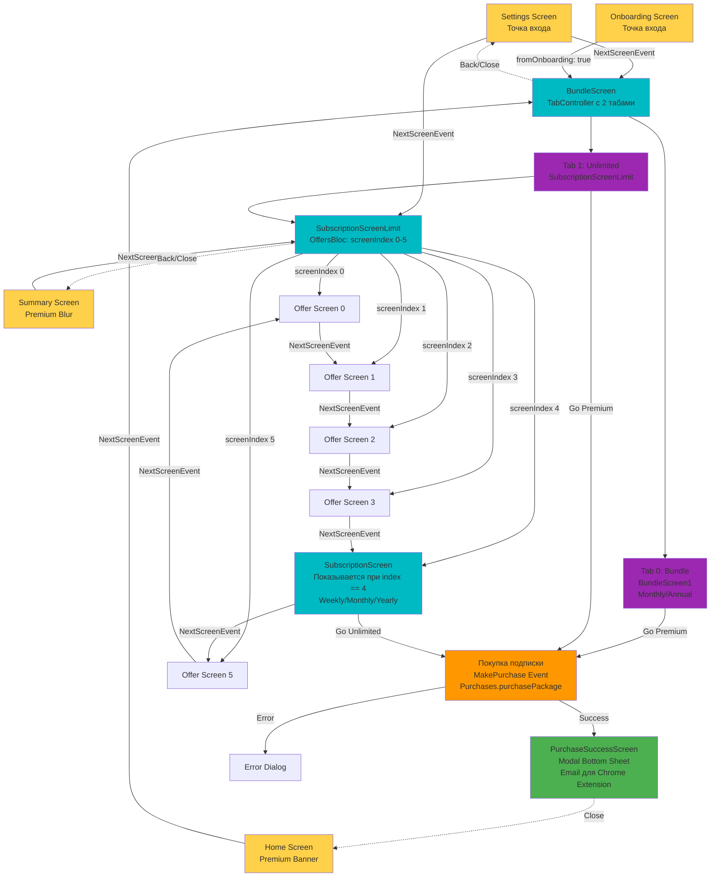
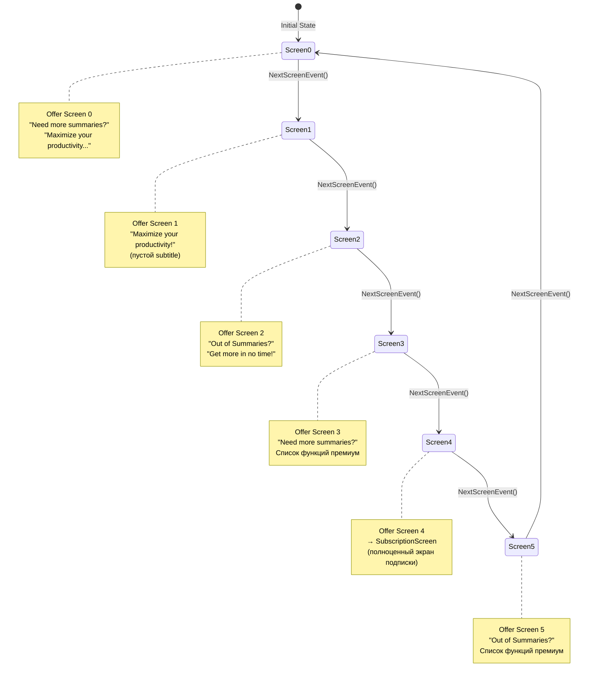
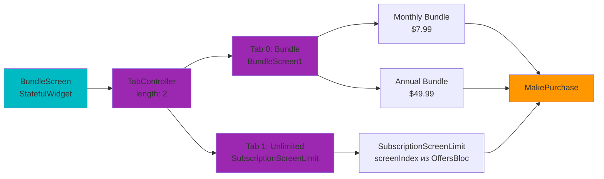
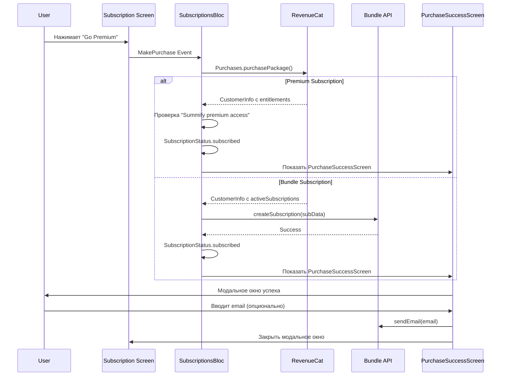
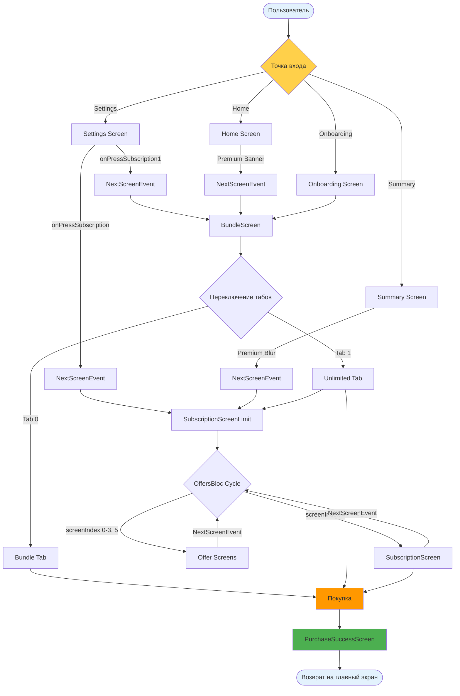

# Схема переходов между экранами подписок (Mermaid)

## Общая схема потока

```mermaid
graph TB
    %% Entry Points
    Settings[Settings Screen<br/>Точка входа]
    Home[Home Screen<br/>Premium Banner]
    Summary[Summary Screen<br/>Premium Blur]
    Onboarding[Onboarding Screen<br/>Точка входа]
    
    %% Main Screens
    BundleScreen[BundleScreen<br/>TabController с 2 табами]
    SubLimit[SubscriptionScreenLimit<br/>OffersBloc: screenIndex 0-5]
    
    %% Tabs in BundleScreen
    Tab0[Tab 0: Bundle<br/>BundleScreen1<br/>Monthly/Annual]
    Tab1[Tab 1: Unlimited<br/>SubscriptionScreenLimit]
    
    %% SubscriptionScreen
    SubScreen[SubscriptionScreen<br/>Показывается при index == 4<br/>Weekly/Monthly/Yearly]
    
    %% Purchase Flow
    Purchase[Покупка подписки<br/>MakePurchase Event<br/>Purchases.purchasePackage]
    Success[PurchaseSuccessScreen<br/>Modal Bottom Sheet<br/>Email для Chrome Extension]
    
    %% Entry Point Connections
    Settings -->|NextScreenEvent| BundleScreen
    Settings -->|NextScreenEvent| SubLimit
    Home -->|NextScreenEvent| BundleScreen
    Summary -->|NextScreenEvent| SubLimit
    Onboarding -->|fromOnboarding: true| BundleScreen
    
    %% BundleScreen Tabs
    BundleScreen --> Tab0
    BundleScreen --> Tab1
    Tab1 --> SubLimit
    
    %% OffersBloc Cycle
    SubLimit -->|screenIndex 0| Offer0[Offer Screen 0]
    SubLimit -->|screenIndex 1| Offer1[Offer Screen 1]
    SubLimit -->|screenIndex 2| Offer2[Offer Screen 2]
    SubLimit -->|screenIndex 3| Offer3[Offer Screen 3]
    SubLimit -->|screenIndex 4| SubScreen
    SubLimit -->|screenIndex 5| Offer5[Offer Screen 5]
    
    %% NextScreenEvent Cycle
    Offer0 -->|NextScreenEvent| Offer1
    Offer1 -->|NextScreenEvent| Offer2
    Offer2 -->|NextScreenEvent| Offer3
    Offer3 -->|NextScreenEvent| SubScreen
    SubScreen -->|NextScreenEvent| Offer5
    Offer5 -->|NextScreenEvent| Offer0
    
    %% Purchase Flow
    Tab0 -->|Go Premium| Purchase
    Tab1 -->|Go Premium| Purchase
    SubScreen -->|Go Unlimited| Purchase
    Purchase -->|Success| Success
    Purchase -->|Error| ErrorDialog[Error Dialog]
    
    %% Back Navigation
    BundleScreen -.->|Back/Close| Settings
    SubLimit -.->|Back/Close| Summary
    Success -.->|Close| Home
    
    style Settings fill:#FFD04A
    style Home fill:#FFD04A
    style Summary fill:#FFD04A
    style Onboarding fill:#FFD04A
    style BundleScreen fill:#00BAC3
    style SubLimit fill:#00BAC3
    style SubScreen fill:#00BAC3
    style Tab0 fill:#9C27B0
    style Tab1 fill:#9C27B0
    style Purchase fill:#FF9800
    style Success fill:#4CAF50
```

## Детальная схема OffersBloc

```mermaid
stateDiagram-v2
    [*] --> Screen0: Initial State
    
    Screen0 --> Screen1: NextScreenEvent()
    Screen1 --> Screen2: NextScreenEvent()
    Screen2 --> Screen3: NextScreenEvent()
    Screen3 --> Screen4: NextScreenEvent()
    Screen4 --> Screen5: NextScreenEvent()
    Screen5 --> Screen0: NextScreenEvent()
    
    note right of Screen0
        Offer Screen 0
        "Need more summaries?"
        "Maximize your productivity..."
    end note
    
    note right of Screen1
        Offer Screen 1
        "Maximize your productivity!"
        (пустой subtitle)
    end note
    
    note right of Screen2
        Offer Screen 2
        "Out of Summaries?"
        "Get more in no time!"
    end note
    
    note right of Screen3
        Offer Screen 3
        "Need more summaries?"
        Список функций премиум
    end note
    
    note right of Screen4
        Offer Screen 4
        → SubscriptionScreen
        (полноценный экран подписки)
    end note
    
    note right of Screen5
        Offer Screen 5
        "Out of Summaries?"
        Список функций премиум
    end note
```

## Схема BundleScreen

```mermaid
graph LR
    BundleScreen[BundleScreen<br/>StatefulWidget]
    
    TabController[TabController<br/>length: 2]
    
    Tab0[Tab 0: Bundle<br/>BundleScreen1]
    Tab1[Tab 1: Unlimited<br/>SubscriptionScreenLimit]
    
    BundleScreen --> TabController
    TabController --> Tab0
    TabController --> Tab1
    
    Tab0 --> Monthly[Monthly Bundle<br/>$7.99]
    Tab0 --> Annual[Annual Bundle<br/>$49.99]
    
    Tab1 --> SubLimit[SubscriptionScreenLimit<br/>screenIndex из OffersBloc]
    
    Monthly --> Purchase[MakePurchase]
    Annual --> Purchase
    SubLimit --> Purchase
    
    style BundleScreen fill:#00BAC3
    style TabController fill:#9C27B0
    style Tab0 fill:#9C27B0
    style Tab1 fill:#9C27B0
    style Purchase fill:#FF9800
```

## Схема процесса покупки

```mermaid
sequenceDiagram
    participant User
    participant UI as Subscription Screen
    participant Bloc as SubscriptionsBloc
    participant RC as RevenueCat
    participant API as Bundle API
    participant Success as PurchaseSuccessScreen
    
    User->>UI: Нажимает "Go Premium"
    UI->>Bloc: MakePurchase Event
    Bloc->>RC: Purchases.purchasePackage()
    
    alt Premium Subscription
        RC-->>Bloc: CustomerInfo с entitlements
        Bloc->>Bloc: Проверка "Summify premium access"
        Bloc->>Bloc: SubscriptionStatus.subscribed
        Bloc->>Success: Показать PurchaseSuccessScreen
    else Bundle Subscription
        RC-->>Bloc: CustomerInfo с activeSubscriptions
        Bloc->>API: createSubscription(subData)
        API-->>Bloc: Success
        Bloc->>Bloc: SubscriptionStatus.subscribed
        Bloc->>Success: Показать PurchaseSuccessScreen
    end
    
    Success->>User: Модальное окно успеха
    User->>Success: Вводит email (опционально)
    Success->>API: sendEmail(email)
    Success->>UI: Закрыть модальное окно
```

## Схема навигации

```mermaid
graph TD
    Start([Пользователь])
    
    Start --> Entry{Точка входа}
    
    Entry -->|Settings| SettingsNav[Settings Screen]
    Entry -->|Home| HomeNav[Home Screen]
    Entry -->|Summary| SummaryNav[Summary Screen]
    Entry -->|Onboarding| OnboardingNav[Onboarding Screen]
    
    SettingsNav -->|onPressSubscription| NextEvent1[NextScreenEvent]
    SettingsNav -->|onPressSubscription1| NextEvent2[NextScreenEvent]
    
    HomeNav -->|Premium Banner| NextEvent3[NextScreenEvent]
    SummaryNav -->|Premium Blur| NextEvent4[NextScreenEvent]
    
    NextEvent1 --> SubLimitNav[SubscriptionScreenLimit]
    NextEvent2 --> BundleNav[BundleScreen]
    NextEvent3 --> BundleNav
    NextEvent4 --> SubLimitNav
    OnboardingNav --> BundleNav
    
    BundleNav --> TabSwitch{Переключение табов}
    TabSwitch -->|Tab 0| BundleTab[Bundle Tab]
    TabSwitch -->|Tab 1| UnlimitedTab[Unlimited Tab]
    
    UnlimitedTab --> SubLimitNav
    
    SubLimitNav --> OffersCycle{OffersBloc Cycle}
    OffersCycle -->|screenIndex 0-3, 5| OfferScreens[Offer Screens]
    OffersCycle -->|screenIndex 4| SubScreenNav[SubscriptionScreen]
    
    OfferScreens -->|NextScreenEvent| OffersCycle
    SubScreenNav -->|NextScreenEvent| OffersCycle
    
    BundleTab --> Purchase[Покупка]
    UnlimitedTab --> Purchase
    SubScreenNav --> Purchase
    
    Purchase --> Success[PurchaseSuccessScreen]
    Success --> End([Возврат на главный экран])
    
    style Start fill:#E3F2FD
    style Entry fill:#FFD04A
    style Purchase fill:#FF9800
    style Success fill:#4CAF50
    style End fill:#E3F2FD
```

