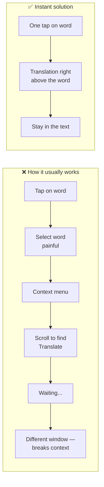
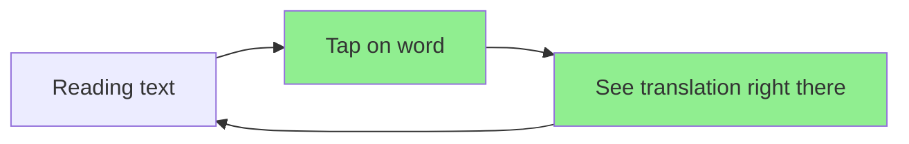

# One-Tap Translation: Why the Old Way Breaks Your Reading Flow

**Marketing article draft — “Instant translation without leaving the text”**

---

## The problem

To translate a single word in a foreign text, users today have to:

1. **Select the word** — finicky selection handles, easy to grab too much or too little.
2. **Find “Translate” in the context menu** — often at the bottom, so they have to scroll.
3. **Wait** — request goes out, response comes back with a delay.
4. **Switch to another screen** — the translation opens in a separate window with different UI. Reading context is lost.

Result: too many steps, waiting, and dropping out of the flow. The user is pulled away from the text itself.


---

## A better way: one tap, instant result

What if:

- The user **taps once** on the word.
- They **instantly** see the translation right above it (tooltip, bubble).
- No separate screen, no menu scrolling, minimal waiting.
- They stay in the foreign text and keep reading.

One tap → result in place → no distraction.


---

## Flow: before vs after

Below is a Mermaid diagram you can screenshot. Render it in [Mermaid Live Editor](https://mermaid.live) or any Mermaid-capable editor, then take a screenshot for the article or social posts.



**Simplified diagram (solution only):**



---

## Marketing messages

- **Pain:** “Translating one word takes time and pulls you out of reading.”
- **Benefit:** “One tap — translation right there, no new screen.”
- **USP:** Instant translation in context, fewer steps, no separate window.

---

## Using the assets

| Asset | File | Use |
|-------|------|-----|
| Problem illustration | `translate-problem-flow.png` | Banners, “how it usually works” posts |
| Solution illustration | `translate-solution-instant.png` | “One tap, instant result” promo |
| Flow diagram | Mermaid code above | Render in mermaid.live → screenshot for article/slides |

After rendering Mermaid, save the screenshot in this folder (e.g. `instant-translation-diagram.png`) and add to the article if needed:

```markdown

```

**Russian versions:** see `instant-translation-article.ru.md` and images with `.ru` suffix (`translate-problem-flow.ru.png`, `translate-solution-instant.ru.png`).
