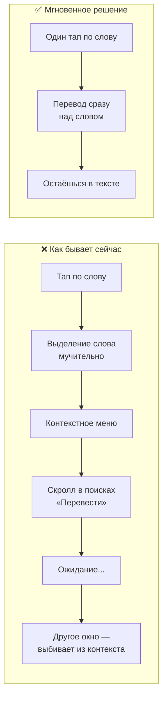
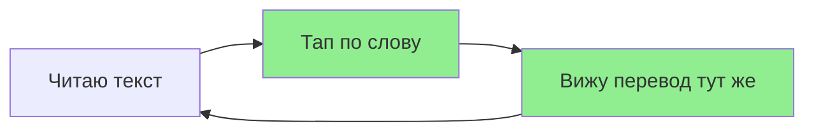

# Перевод в одно касание: почему старый способ мешает читать

**Набросок статьи для маркетинга — тема «мгновенный перевод без отвлечения от текста»**

---

## В чём проблема

Чтобы перевести одно слово в чужом тексте, пользователю сегодня приходится:

1. **Долго выделять слово** — поймать курсор, растянуть выделение, не захватить лишнее.
2. **Искать пункт «Перевести»** в контекстном меню — он часто внизу, нужно скроллить.
3. **Ждать** — запрос уходит, ответ приходит с задержкой.
4. **Переключаться в другое окно** — перевод показывается в отдельном экране, с другим дизайном. Контекст чтения теряется.

Итого: много шагов, ожидание и выход из потока чтения. Пользователь отвлекается от самого текста.


---

## Другой путь: один тап — сразу результат

Что если:

- Пользователь **один раз тапает** по слову.
- **Мгновенно** видит перевод прямо над словом (подсказка, пузырёк).
- Никакого отдельного окна, никакого скролла меню, минимум ожидания.
- Остаётся в контексте иностранного текста и продолжает читать.

Один тап → результат в том же месте → без отвлечения.


---

## Схема: было vs стало

Ниже — Mermaid-диаграмма для скриншота. Её можно отрендерить в [Mermaid Live Editor](https://mermaid.live) или в любом редакторе с поддержкой Mermaid, затем сделать скриншот для статьи или соцсетей.



**Вариант упрощённой схемы (только решение):**



---

## Месседжи для маркетинга

- **Боль:** «Перевод одного слова отнимает время и выбивает из чтения.»
- **Выгода:** «Один тап — перевод здесь и сейчас, без смены экрана.»
- **УТП:** Мгновенный перевод в контексте, без лишних шагов и другого окна.

---

## Использование материалов

| Материал | Файл | Использование |
|----------|------|----------------|
| Иллюстрация «проблема» | `translate-problem-flow.ru.png` | Баннеры, посты «как бывает сейчас» |
| Иллюстрация «решение» | `translate-solution-instant.ru.png` | Промо «один тап — результат» |
| Схема потока | Mermaid-код выше | Рендер в mermaid.live → скриншот для статьи/слайдов |

После рендера Mermaid сохраните скриншот в эту папку (например, `instant-translation-diagram.ru.png`) и при необходимости добавьте в статью:

```markdown

```

**English version:** see `instant-translation-article.md` and images without suffix (`translate-problem-flow.png`, `translate-solution-instant.png`).
