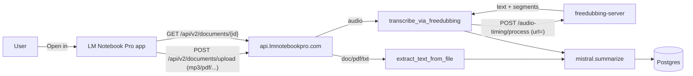

# Audio «Open in» + транскрипция через Freedubbing

Связанные репозитории:
- `SummifyFlutter` (этот)
- `api.lmnotebookpro.com`
- `freedubbing` (читаем только, изменения не нужны — используем готовый образ)

## Контекст

Коммит `f7a2dd3` уже открыл «Open in» на Android/iOS для широкого набора форматов, но:

- пайплайн Flutter → `POST /api/v2/documents/upload` рассчитан **только на документы** (PDF/TXT/DOCX), см. [`file_text_extraction_service.py`](../../api.lmnotebookpro.com/python-api/app/services/file_text_extraction_service.py);
- в UI-пикере [`add_summary_button.dart`](../lib/widgets/add_summary_button.dart) разрешены `pdf, doc, docs, rtf, txt, epub` (даже `doc`/`docs`/`rtf`/`epub` сервер пока не поддерживает);
- «Open in» сейчас декларирует `image/*`, `video/*`, `audio/*`, `public.data`, `public.image` и пр. — это обещает больше, чем приложение умеет обрабатывать. Получится ошибка 415 «Unsupported file format» либо висящий `SummaryData` с `shortSummaryError`.

Цель:
1. **Сузить «Open in» до реально поддерживаемого набора**: документы (PDF/DOCX/TXT) + **аудио**.
2. **На бэкенде** распознавать аудио и прогонять через **Freedubbing** (Whisper), получая текст, и далее использовать тот же пайплайн суммаризации Mistral.
3. Поскольку Whisper на CPU небыстр, документ создаётся сразу со статусом `loading`, фоновая таска доводит до `done`/`error`, мобила опрашивает `GET /api/v2/documents/{id}`.

## Общая схема



## Решения, зафиксированные с пользователем

1. Scope: **только аудио** (без видео) на первой итерации.
2. Deploy Freedubbing: **в том же docker-compose** api.lmnotebookpro.com, во внутренней сети, порт наружу не выставляется.
3. UX: **async + polling**. Endpoint возвращает документ со статусом `loading`, фон транскрибирует, мобила периодически опрашивает.

## Поддерживаемые форматы

Аудио (MP3 первым приоритетом): `mp3, wav, m4a, aac, ogg, flac, opus, wma, webm`.  
Документы оставляем как сейчас: `pdf, docx, txt` (то, что реально читает бэкенд).

---

## Часть A — `api.lmnotebookpro.com`

### A1. Compose

Файл: `docker-compose.yml`. Добавить сервис:

```yaml
freedubbing-server:
  image: ghcr.io/easably/freedubbing/freedubbing-server:latest
  container_name: lmnotebookpro-freedubbing
  restart: unless-stopped
  environment:
    - DATA_DIR=/app/data
    # Для Phase 1 достаточно дефолтов; ключи Google/TTS не нужны, т.к. используем только Whisper
  volumes:
    - freedubbing_data:/app/data
  networks:
    - app_net
  # Без ports: обращаемся изнутри через http://freedubbing-server:8000
```

И:

```yaml
volumes:
  ...
  freedubbing_data:
```

В сервисе `python-api` добавить ENV:

```yaml
- FREEDUBBING_URL=${FREEDUBBING_URL:-http://freedubbing-server:8000}
- FREEDUBBING_TIMEOUT=${FREEDUBBING_TIMEOUT:-600}
- AUDIO_TRANSCRIPTION_ENABLED=${AUDIO_TRANSCRIPTION_ENABLED:-true}
```

Примечание: freedubbing-server на CPU потребляет от ~1GB RAM (модель Whisper `medium`). Если на DO дроплет маленький — имеет смысл зафиксировать `small` моделью через отдельный ENV, но это уже инфра-вопрос.

### A2. Новый сервис транскрипции

Файл: `python-api/app/services/audio_transcription_service.py` (новый).

- Функция `async def transcribe_audio_file(filename: str, data: bytes) -> str` — на вход байты аудио, на выход склеенный `text`.
- Алгоритм:
  1. Сохранить байты на диск под подписанным путём в `file_uploads` (через `save_file` + `storage_key`) — **тот же volume, что у `python-api`**; Freedubbing отдельно не видит этот файл.
  2. В Phase 1 — **простой подход**: шлём в Freedubbing не URL, а **POST multipart** на специальный эндпоинт… но в актуальном образе этого нет.
  3. Поэтому используем существующий `POST /audio-timing/process` из [`routes/audio_timing.py`](../../freedubbing/server/app/routes/audio_timing.py), который принимает `{"url": "..."}`. Значит нужно сделать аудио доступным по внутреннему URL. Варианты:
     - **Через nginx/Caddy static**: проще всего — примонтировать `file_uploads` и отдавать `/api/v1/internal/files/{key}` **только внутри сети**, а Freedubbing пусть скачивает по `http://lmnotebookpro-python-api:8002/api/v1/internal/files/{key}` (именно это — path A в плане).
     - **Через общий volume**: примонтировать `file_uploads` в freedubbing-server в режиме read-only и добавить ENV `FREEDUBBING_LOCAL_FILES_PREFIX` + научить его читать локально — но это изменения во freedubbing, мы их не делаем.
  Решение: **path A** — python-api сам отдаёт файл по внутреннему URL (без Firebase auth, внутренняя сеть).

- Кроме того, Freedubbing ответит `text`, `segments`, `language`, `duration`. Для summary нам важно только `text`. Если `task_id` недоступен (sync endpoint) — получаем текст сразу; если таймаут — переключимся на `/audio-timing/process/async` + `/audio-timing/process/status` c polling.

Сигнатура:

```python
async def transcribe_audio_file(
    filename: str,
    data: bytes,
    *,
    client: httpx.AsyncClient,
) -> str: ...
```

Ошибки: сетевые, 4xx/5xx от Freedubbing, пустой `text` → `ValueError("transcription failed")`.

### A3. Расширить extract

Файл: `python-api/app/services/file_text_extraction_service.py`.

- Вынести текущую логику в `extract_text_from_document`.
- Добавить `AUDIO_SUFFIXES = {".mp3", ".wav", ".m4a", ".aac", ".ogg", ".flac", ".opus", ".wma", ".webm"}`.
- В `extract_text_from_file` оставить только **синхронный путь для документов**. Для аудио пусть маршрут в роуте выбирает `transcribe_audio_file`.

### A4. Новый внутренний endpoint для отдачи файла (для Freedubbing)

Файл: `python-api/app/routes/documents_routes.py` (или отдельный `internal_routes.py`).

- `GET /api/v1/internal/files/{key}` — **без Firebase auth**, но разрешаем только при подключении с **внутреннего IP** / доверенной сети; уместный хак для MVP: добавить `X-Internal-Token` заголовок, а в env `INTERNAL_API_TOKEN`. Freedubbing внутри сети передаст этот токен (через query param на whoever consumes) — **но** в текущем Freedubbing при загрузке URL нет места для токена. Поэтому ограничиваемся проверкой:
  - сетевой адрес запроса из `docker internal subnet`, **или**
  - если проще — вообще не аутентифицировать (доступно только во внутренней сети, порт наружу Caddy не проксирует).

Решение MVP: **не проксировать через Caddy**, endpoint существует только на внутреннем порту `8002` → по сути доступен только внутри `app_net`. Проверку origin оставить как TODO на фазу hardening.

### A5. Роут `POST /api/v2/documents/upload`

Файл: `python-api/app/routes/documents_routes.py`.

- По суффиксу файла определяем branch:
  - **document**: как сейчас, синхронно — `extract_text → save → summarize → return`.
  - **audio**: 
    1. Сохранить файл и создать документ со `source_type="file"`, `short_summary_status="loading"`, `original_text=None`.
    2. Запустить `BackgroundTasks.add_task(_process_audio_document, doc_id, user_id, filename, body)`.
    3. Вернуть документ **сразу** — мобиле нужно что-то с `id` для polling.
- Фоновая таска `_process_audio_document`:
  1. `text = await transcribe_audio_file(...)`.
  2. Обновить `original_text` (truncate до 500 000) + `context_length`.
  3. Вызвать `summarize(...)`, обновить `short_summary`, `short_summary_status="complete"`.
  4. В except — `short_summary_status="error"`, сохранить `summaryError`.

Важно: сейчас `DocumentDetail` возможно не предоставляет поле статуса. Проверить `app/schemas/document_schemas.py` и, если нет — добавить `short_summary_status: str | None`.

### A6. Тесты

- `tests/test_audio_transcription_smoke.py`: мокнем `httpx`, подтвердим сборку URL и парсинг ответа Freedubbing.
- Ручной e2e: docker compose up; `curl -X POST ...documents/upload -F 'file=@testdata/20251004.mp3'` (в тестах freedubbing есть такой файл).

---

## Часть B — `SummifyFlutter`

### B1. Сузить Open-with до документов + аудио

Файл: [`android/app/src/main/AndroidManifest.xml`](../android/app/src/main/AndroidManifest.xml).  
Оставить intent-filter для: `application/pdf`, `application/msword`, Office Open XML (3 шт), `application/vnd.ms-{excel|powerpoint}`, `text/plain`, `application/epub+zip`, `audio/*` (именно `audio/*`, чтобы не плодить 9 фильтров). `content://` и `file://` без mime — оставить (типовой путь из Files app), но **без** `image/*`, `video/*`.

Файл: [`ios/Runner/Info.plist`](../ios/Runner/Info.plist).  
В `LSItemContentTypes` оставить: `public.pdf`, `public.text`, `public.plain-text`, `org.openxmlformats.wordprocessingml.document`, `com.microsoft.word.doc`, `public.audio` (+ `public.mp3`, `public.mpeg-4-audio`). Убрать: `public.image`, `public.movie`, `public.data`, spreadsheet/presentation (пока не умеем).

### B2. Dart whitelist

Файл: [`lib/main.dart`](../lib/main.dart), функция `_handleSharedMedia`.

- Перед `_summariesBloc.add(GetSummaryFromFile(...))` — проверять расширение и MIME:
  - разрешено: `pdf, docx, txt, mp3, wav, m4a, aac, ogg, flac, opus, wma, webm`;
  - иначе — показать toast «Формат не поддерживается» (можно через существующую `Toastification`).

Файл: [`lib/widgets/add_summary_button.dart`](../lib/widgets/add_summary_button.dart).

- `allowedExtensions`: `['pdf', 'docx', 'txt', 'mp3', 'wav', 'm4a', 'aac', 'ogg', 'flac', 'opus', 'webm']`.
- (Убираем `doc`, `docs`, `rtf`, `epub` — сервер их не читает, чтобы не плодить 415.)

### B3. Async polling в Bloc

Файл: [`lib/bloc/summaries/summaries_bloc.dart`](../lib/bloc/summaries/summaries_bloc.dart).

Сейчас `_loadSummaryFromFile` **ждёт** ответа `uploadDocument` синхронно. Для аудио сервер отдаст документ со статусом `loading`. Нужно:

1. После `uploadDocument` — если `serverDoc.short_summary_status == 'loading'` или `short_summary` пустой, перейти в режим polling:
   - каждые 3 сек `GET /api/v2/documents/{id}` (в [`lib/services/document_api_service.dart`](../lib/services/document_api_service.dart) уже есть `getDocument`),
   - выходим, когда `short_summary_status in {complete, error}` или по таймауту (например, 4 минуты).
2. Пока polling — `SummaryData.shortSummaryStatus = SummaryStatus.loading` (текущее поле уже есть), UI уже умеет показывать загрузку.
3. По ошибке — сохранить `shortSummaryError` и показать SnackBar / Toast.

Mixpanel-ивенты тот же `SummarizingSuccess/Error` + `option: 'audio'` для метрик (в [`mixpanel_bloc.dart`](../lib/bloc/mixpanel/mixpanel_bloc.dart) может потребоваться новая опция).

### B4. Манифест + Info.plist документация

В том же коммите обновить комментарии в AndroidManifest и добавить пометку в Info.plist, что расширение наборов — это вопрос поддержки на сервере.

---

## Что вне скоупа этой задачи

- Видео → через Freedubbing: позже. Если поднять, понадобится тот же poll-pipeline, но с video suffix’ами и, возможно, upload через multipart (сейчас Freedubbing принимает URL; для video тоже OK).
- Перевод текста транскрипции на выбранный пользователем язык — отдельная задача, сейчас просто оригинальный текст + обычный `summarize`.
- RAG-индексация audio-документов — работает автоматически, как для любого `original_text` (но может быть шумной; позже улучшить нарезкой по сегментам).

## Проверка руками

1. **Поднять compose**: `docker compose up -d --build`; дождаться `freedubbing-server` `healthy` (у него есть `/health`).
2. **Curl**:
   ```bash
   curl -H "Host: api.lmnotebookpro.com" \
     -F 'file=@path/to/sample.mp3' \
     -F 'type_summary=short' \
     "http://localhost/api/v2/documents/upload"
   ```
   Ожидаем 201 с документом, `short_summary_status=loading`.
3. Ждём ~30–120 сек, `GET /api/v2/documents/{id}` → статус `complete`, `short_summary` непустой.
4. **Mobile**: «Files → sample.mp3 → Open with → LM Notebook Pro» → появляется карточка «загружается», через пару минут — summary.

## Этапы / TODO

- [ ] SummifyFlutter: сузить Open-with до документов + audio; в Dart whitelist по расширению
- [ ] SummifyFlutter: поддержать асинхронный статус loading/done в пайплайне GetSummaryFromFile
- [ ] api.lmnotebookpro.com: добавить freedubbing-server в docker-compose.yml с env FREEDUBBING_URL
- [ ] api.lmnotebookpro.com: в file_text_extraction_service добавить audio path через Freedubbing /audio-timing/process
- [ ] api.lmnotebookpro.com: document.short_summary_status использовать для audio, background-task + polling через GET /documents/{id}
- [ ] Smoke-тест ручной: mp3 → загрузка → polling → summary
